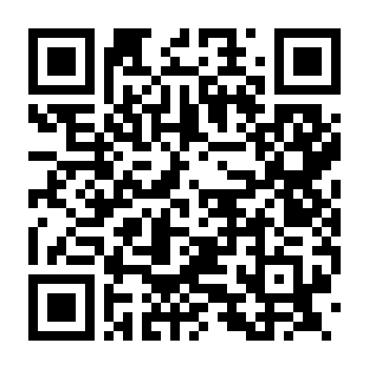
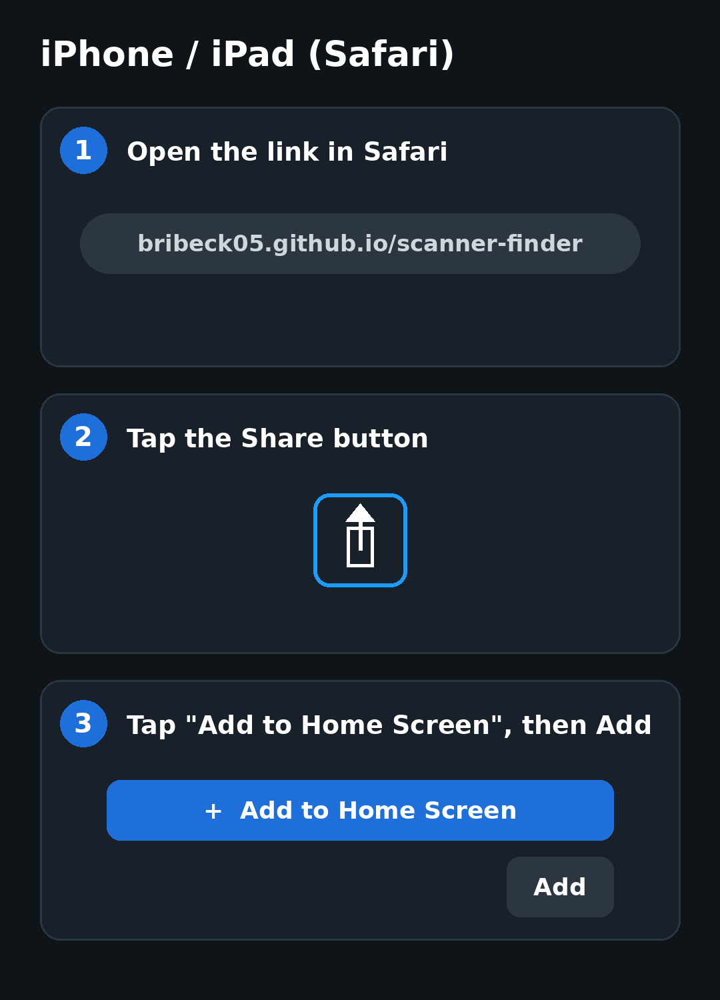
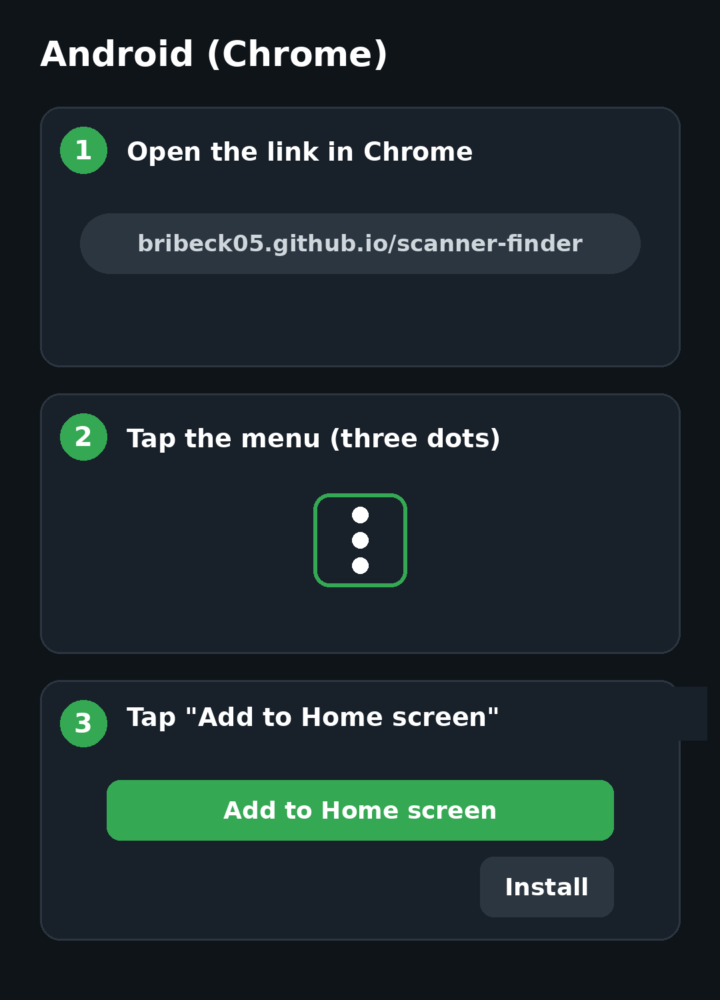

# Scanner Finder
Search OpenMHz police/fire/EMS scanner systems by location and listen to live calls.

## Open the app
Scan with your phone camera or visit **https://bribeck05.github.io/scanner-finder/**

## Add it to your Home Screen
| iPhone / iPad (Safari) | Android (Chrome) |
|---|---|
|  |  |

On Android, the option may be called **Install app** instead.
- `docs/` – mobile web app (served by GitHub Pages)
- `mobile/` – iOS + Android app (Expo / React Native), see mobile/README.md

Data from the public OpenMHz API (https://openmhz.com).

## License
MIT – see [LICENSE](LICENSE). Scanner audio and data belong to OpenMHz and its contributors and are not covered by this license.
